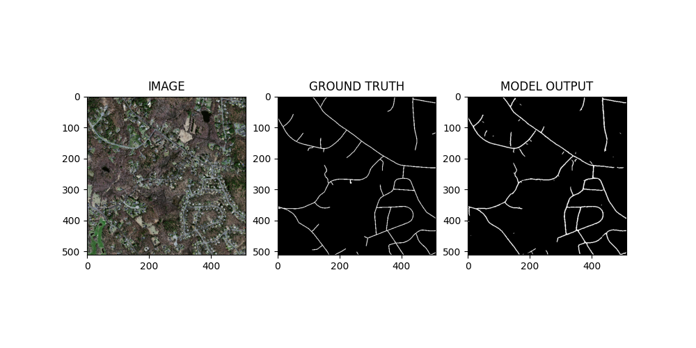

# Road Segmentation Using Aerial Images

Road segmentation, which helps to identify primary, secondary, and tertiary roads, is considered one of the major areas that directly contribute to improving geospatial analysis. The ability to isolate roads from aerial images comprising complex structures plays an important role in improved navigation systems, autonomous driving, traffic management, disaster mitigation, environmental monitoring,urban planning etc.

## Installation

This code was developed with Python 3.10.12 on Linux Mint 21.3. Python requirements can installed by:

```bash
pip install -r requirements.txt
```
## Datasets
Dataset in this repo is the subset(200 images and its masks) of the original dataset (Massachusetts Roads Dataset) which consists of 1171 aerial images of the state of Massachusetts. Each image is 1500×1500 pixels in size, covering an area of 2.25 square kilometers.

[Subset dataset](https://github.com/parth1620/Road_seg_dataset/tree/master)\
[Full dataset](https://www.cs.toronto.edu/~vmnih/data/)

## Models
The [segmentation_models_pytorch](https://github.com/qubvel/segmentation_models.pytorch) library is used which allows us to select various pretrained models as per our requirement. The desired model name and weight can be set in the `config.yaml` file and use can be seen in the `model.py `file.

## Training

Training is done by the `train.py` script. Various training parameters can be changed in the `config.yaml` file as required.

## Evaluation/Visualisation
Evaluation or visualisation of the trained networks is done using the `infer.py` file.

